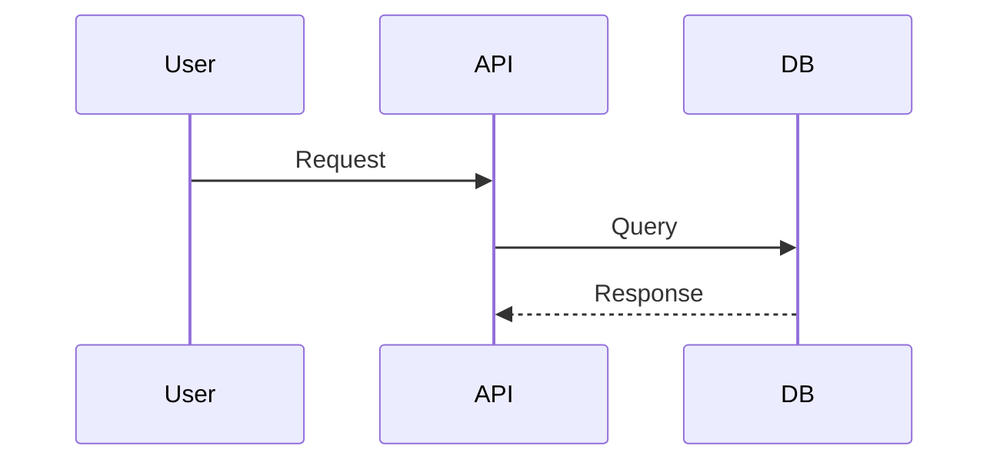

# Hyper-Spec: A Next-Generation Architecture for Integrated Spec-Driven Development

## 1. Executive Summary: The Evolution of Intent Engineering

The software development industry stands at a critical juncture where the friction between human intent and machine implementation is becoming the primary bottleneck. We have moved past the era of "vibe coding"—a loosely structured, prompt-based interaction with Large Language Models (LLMs) that prioritizes speed over structural integrity—and are entering the age of Spec-Driven Development (SDD).

The existing solutions, such as GitHub's spec-kit, have successfully demonstrated the utility of using specifications as the "source of truth" for AI agents. However, these early iterations often suffer from context switching, reliance on external chat interfaces, and a lack of rigorous, enforceable "steering" mechanisms that bind the AI to specific architectural and non-functional requirements.

This report presents Hyper-Spec, a re-architected SDD solution designed to live entirely within the Integrated Development Environment (IDE), specifically Visual Studio Code (VS Code). Unlike previous iterations that operated as loosely coupled CLI tools or chat plugins, Hyper-Spec is architected as a native resident of the IDE, leveraging the raw performance of the modern Python ecosystem powered by `uv`.

The core value proposition of Hyper-Spec is **Aligned and Detailed Steering**. By embedding a "Constitutional" architecture directly into the project's file system and enforcing it via interactive CLI "interviews", we transform the specification process from a passive documentation task into an active, executable workflow. This solution utilizes native VS Code features—such as `tasks.json` for orchestration and Markdown preview for visualization—to create a seamless "Intent-to-Implementation" loop that requires no context switching.

This document serves as both the research justification and the comprehensive specification bundle for the Hyper-Spec system. It details the theoretical framework, the technical implementation of the `uv`-based toolchain, the VS Code integration strategy, and the templates required to operationalize this new standard.

## 2. The Theoretical Framework: From Passive Specs to Active Steering

To understand the necessity of Hyper-Spec, one must first analyze the limitations of current generative AI workflows and the specific failure modes of "vibe coding" in enterprise environments.

### 2.1. The Failure of Unconstrained Generation

"Vibe coding" relies on the implicit knowledge contained within a short context window. A developer types a prompt like "Add a login page," and the model infers the rest based on generic training data. In simple prototypes, this works. In complex systems, however, this leads to **Context Drift**:

* **Architectural Violations**: The model introduces a new library (e.g., `requests`) when the project standardized on another (e.g., `httpx`) because the prompt didn't explicitly forbid it.
* **Security Regressions**: The model generates code that works but lacks input validation or error handling mandated by company policy.
* **Phantom Dependencies**: The model assumes the existence of utility functions that don't exist, leading to hallucinations.

Hyper-Spec addresses these failures through **Constitutional AI Steering**. Instead of relying on the model's training data, we inject a rigid "Constitution"—a set of non-negotiable architectural rules—into every interaction. This is not merely a "system prompt" but a hierarchical context structure that anchors the AI to the project's specific reality.

### 2.2. The "Intent-to-Implementation" (I2I) Protocol

Hyper-Spec formalizes the SDD process into a rigorous protocol known as **Intent-to-Implementation (I2I)**. This protocol enforces a four-stage lifecycle for every unit of work, prohibiting the direct generation of code without a validated plan.

| Stage | Description | Artifact | Validation Mechanism |
| :--- | :--- | :--- | :--- |
| **1. Specify** | The structured capture of user intent, domain constraints, and success criteria. | `spec.md` | Interactive CLI Interview (Steering) |
| **2. Plan** | The translation of business requirements into a technical blueprint. | `plan.md` | AI-generated "Confidence Score" & Human Review |
| **3. Task** | The decomposition of the plan into atomic, sequential execution steps. | `tasks.md` | Dependency Analysis |
| **4. Implement** | The generation of code and tests based strictly on the tasks. | Source Code | Automated Test Suites & Linting |

This protocol ensures that "thinking" is separated from "coding." By forcing the AI to generate a `plan.md` before it touches any source files, we allow the human architect to intervene and correct misconceptions at the cheapest possible stage.

### 2.3. The IDE as the Operating System

The decision to decouple SDD from the web browser and embed it into VS Code is strategic. The IDE is the "operating system" of the developer. When a developer has to leave the IDE to chat with a bot, they lose access to the linter, the file explorer, and the terminal history.

Hyper-Spec treats VS Code as the UI platform. We utilize:

* `tasks.json`: To serve as the "Menu System" for the application, triggering Python scripts without requiring the user to memorize CLI arguments.
* `launch.json`: To allow developers to debug the specification tool itself or the generated code.
* **Markdown Preview & Mermaid**: To provide rich visual feedback on the specifications without building a custom GUI.

## 3. The Runtime Architecture: The UV-Python Ecosystem

The foundation of Hyper-Spec is a modern, high-performance Python stack. We explicitly reject legacy tools like `pip` and `virtualenv` in favor of `uv`, a Rust-based package manager that redefines the developer experience.

### 3.1. Why uv is Non-Negotiable

In an agentic workflow, the speed of environment provisioning is a functional requirement. If an agent determines it needs a new library, the "install" step must be near-instantaneous to maintain flow. `uv` provides 10-100x performance improvements over `pip`.

**Comparative Analysis of Python Package Managers:**

| Feature | pip / venv | poetry | uv (Selected) |
| :--- | :--- | :--- | :--- |
| **Language** | Python | Python | Rust |
| **Speed** | Slow (Single-threaded) | Slow (Dependency Resolution) | Ultra-Fast (10-100x) |
| **Locking** | Manual (`requirements.txt`) | Native (`poetry.lock`) | Native (`uv.lock`) |
| **Script Running** | No native support | Limited | First-class (`uv run`) |
| **Python Management** | External (`pyenv`) | External | Integrated (`uv python`) |
| **Workspace Support** | No | Yes | Yes (Cargo-style) |

**Key Architectural Decision**: We use `uv` not just for installation, but as the process runner. All commands in Hyper-Spec are invoked via `uv run`. This ensures that:

* **Isolation**: The tool runs in an ephemeral or strictly managed environment, independent of the user's global Python installation.
* **Reproducibility**: The exact version of the `hyper-spec` tool and its dependencies (like `pydantic` or `openai`) are locked in `uv.lock`.
* **Bootstrapping**: A new developer can clone the repo and run `uv run hyper_spec.py` immediately without manually creating a virtual environment. `uv` handles the setup transparently.

### 3.2. The pyproject.toml Configuration

The project is defined strictly by the `pyproject.toml` standard. This file serves as the single source of truth for the project's metadata and dependencies.

**Specification: `pyproject.toml`**

```toml
[project]
name = "hyper-spec-core"
version = "2.0.0"
description = "Integrated Spec-Driven Development Environment"
readme = "README.md"
requires-python = ">=3.12"
dependencies = [
    "typer[all]>=0.9.0",     # CLI Framework with Rich integration
    "pydantic>=2.5.0",       # Data validation and structural enforcement
    "jinja2>=3.1.0",         # Template engine for generating specs
    "rich>=13.0.0",          # Terminal UI (tables, colors, progress)
    "openai>=1.0.0",         # AI Client (configurable provider)
    "pyyaml>=6.0",           # Configuration parsing
    "instructor>=1.0.0",     # Structured output patch for OpenAI
]

[tool.uv]
dev-dependencies = []

[build-system]
requires = ["hatchling"]
build-backend = "hatchling.build"

[tool.ruff]
line-length = 100
target-version = "py312"

[tool.pytest.ini_options]
minversion = "6.0"
addopts = "-ra -q"
testpaths = ["tests"]
```

**Analysis**: This configuration enforces Python 3.12+, leveraging the latest language features. The inclusion of `instructor` alongside `pydantic` is critical for "Steering," as it allows us to force LLMs to output valid JSON schemas rather than free text.

## 4. The Steering Engine: CLI Design and Interactive Protocols

The brain of Hyper-Spec is a Python CLI tool, `hyper_spec.py`, built using Typer. We choose Typer over `argparse` because it allows us to build "Interview Protocols" directly into the command arguments, leveraging Python type hints for validation.

### 4.1. The "Interviewer Pattern"

Steering is not just about telling the AI what to do; it's about the AI (or the tool) asking the human the right questions. We implement the **Interviewer Pattern**, where the CLI actively solicits the necessary context to prevent "vibe coding."

When a user runs `hyper-spec new`, the tool does not simply create a file. It initiates a structured dialogue:

* **Goal Elicitation**: "What is the high-level goal?"
* **Scope Boundary**: "What is explicitly OUT of scope?"
* **Constitutional Check**: "Does this feature require changes to the database schema? (y/n)"
* **Impact Analysis**: "Will this touch the authentication layer?"

This dialogue is powered by Typer's prompt capabilities (`typer.prompt`, `typer.confirm`), ensuring that the resulting `spec.md` is populated with high-quality, thought-out requirements rather than empty placeholders.

### 4.2. Command Architecture

The CLI is organized into four primary verbs that map to the I2I protocol.

**Command Reference:**

| Command | Arguments | Description |
| :--- | :--- | :--- |
| `init` | `--force` | Bootstraps the `.vscode` and `specs` directories. Checks for `uv`. |
| `new` | `--name`, `--interactive` | Creates a new feature branch and spec file. Runs the steering interview. |
| `plan` | `--spec-file`, `--model` | Reads the Spec + Constitution, generates a technical Plan. |
| `implement` | `--plan-file`, `--auto-approve` | Executes the Plan, generating code and running verification tasks. |

### 4.3. The Constitutional Context Injection

When the `plan` or `implement` commands are executed, the CLI performs a "Context Injection" operation. It reads the files in `specs/.constitution/` and prepends them to the system prompt of the LLM.

**Mechanism:**

1. **Load**: Read `specs/.constitution/rules.md` and `specs/.constitution/architecture.md`.
2. **Synthesize**: Concatenate these into a "System Directive."
3. **Inject**: Pass this directive to the LLM alongside the user's `spec.md`.

This ensures that the AI "knows" the project rules (e.g., "Always use Pydantic for DTOs") without the user having to repeat them in every prompt.

## 5. The VS Code Integration Layer: Native Experience

To satisfy the requirement that the solution "MUST live in the IDE" and "use built-in features," we utilize VS Code's configuration files as the primary interface. This avoids the complexity of writing a custom VS Code Extension (TypeScript) while achieving nearly the same level of integration.

### 5.1. The tasks.json Orchestrator

We map the Python CLI commands to VS Code Tasks. This allows developers to trigger complex workflows using the Command Palette (`Ctrl+Shift+P`) or keybindings (`Ctrl+Shift+B`).

**Specification: `.vscode/tasks.json`**

```json
{
    "version": "2.0.0",
    "inputs": [
        {
            "id": "featureName",
            "type": "promptString",
            "description": "Enter the name of the new feature (e.g., user-login)"
        }
    ],
    "tasks": [
        {
            "label": "Hyper-Spec: 1. Initialize Project",
            "type": "shell",
            "command": "uv",
            "args": [
                "run",
                "hyper_spec.py",
                "init"
            ],
            "group": "none",
            "presentation": {
                "reveal": "always",
                "panel": "shared"
            },
            "problemMatcher": []
        },
        {
            "label": "Hyper-Spec: 2. Create New Feature Spec",
            "type": "shell",
            "command": "uv",
            "args": [
                "run",
                "hyper_spec.py",
                "new",
                "--name", "${input:featureName}"
            ],
            "group": {
                "kind": "build",
                "isDefault": false
            },
            "presentation": {
                "echo": true,
                "reveal": "always",
                "focus": true,
                "panel": "shared"
            }
        },
        {
            "label": "Hyper-Spec: 3. Generate Implementation Plan",
            "type": "shell",
            "command": "uv",
            "args": [
                "run",
                "hyper_spec.py",
                "plan",
                "--spec", "${file}"
            ],
            "group": "build",
            "presentation": {
                "reveal": "always"
            },
            "dependsOn": []
        },
        {
            "label": "Hyper-Spec: 4. Execute Implementation",
            "type": "shell",
            "command": "uv",
            "args": [
                "run",
                "hyper_spec.py",
                "implement",
                "--plan", "${file}"
            ],
            "group": "build"
        }
    ]
}
```

**Deep Dive**: Note the use of `${file}` in the args. This context-aware variable means the user can simply have the `spec.md` open in their editor, run the "Generate Plan" task, and the tool automatically targets the active file. This friction-free interaction is superior to copying and pasting paths into a terminal.

### 5.2. Workspace Settings and Hiding Complexity

To maintain a clean developer experience, we use `settings.json` to hide the internal machinery of Hyper-Spec. The `.templates` and `.constitution` folders are vital for the tool but distractions for the daily coder.

**Specification: `.vscode/settings.json`**

```json
{
    "python.defaultInterpreterPath": "${workspaceFolder}/.venv/bin/python",
    "python.terminal.activateEnvironment": true,
    "files.exclude": {
        "**/.git": true,
        "**/.DS_Store": true,
        "**/**pycache**": true,
        "specs/.templates": true,  // Hide templates to reduce clutter
        "specs/**/context.json": true // Hide machine metadata
    },
    "search.exclude": {
        "**/node_modules": true,
        "**/.venv": true,
        "specs/.templates": true
    },
    "[markdown]": {
        "editor.defaultFormatter": "esbenp.prettier-vscode",
        "editor.formatOnSave": true,
        "editor.wordWrap": "on"
    },
    "mermaid.theme": "dark"
}
```

**Insight**: Hiding `context.json` is crucial. This file contains the machine-readable state of the spec (e.g., checksums, file lists). If a user edits this manually, they break the steering mechanism. By hiding it via `files.exclude`, we protect the integrity of the process.

### 5.3. Extension Recommendations

We cannot assume the user has the right tools. We mandate them via `extensions.json`.

**Specification: `.vscode/extensions.json`**

```json
{
    "recommendations": [
        "charliermarsh.ruff",
        "tamasfe.even-better-toml",
        "bierner.markdown-mermaid"
    ]
}
```

The `bierner.markdown-mermaid` extension is particularly vital as it allows the `plan.md` (which contains Mermaid charts of the architecture) to be rendered directly in the preview pane.

## 6. Detailed System Specifications: The Document Bundle

This section contains the actual content of the templates and constitutional documents that the `hyper-spec init` command will generate. These are the "refined templates" requested.

### 6.1. Spec Document 1: The Constitution (`rules.md`)

This document serves as the "Supreme Court" for the AI. It is injected into every prompt.

**File: `specs/.constitution/rules.md`**

```markdown
# Project Constitution: The Immutable Laws

## 1. Architectural Integrity
*   **Layered Architecture**: Code must be separated into Interface (API), Application (Service), and Infrastructure (DB/External) layers.
*   **Dependency Direction**: Inner layers (Domain) must NEVER depend on outer layers (API/DB).
*   **State Management**: All state changes must be transactional.

## 2. Coding Standards (Non-Negotiable)
*   **Type Safety**: All Python functions must have full type hints (`typing` or built-ins).
*   **Docstrings**: All public functions must have Google-style docstrings explaining args, returns, and raises.
*   **Error Handling**: Never use `bare except:` clauses. Always catch specific exceptions and log them with context.
*   **Configuration**: All config must be loaded via `pydantic-settings` from env vars. No hardcoded strings.

## 3. Technology Allow-List
*   **Web**: FastAPI
*   **Data**: SQLModel (Async)
*   **Testing**: Pytest, Pytest-Asyncio
*   **Package Manager**: UV
*   **Logging**: Structlog (JSON format)

## 4. Steering Directives for AI
*   If a user request violates these rules, you must reject the request and explain the violation.
*   Do not hallucinate imports. Only use libraries listed in `pyproject.toml`.
*   When writing tests, always include edge cases (null inputs, empty lists).
```

### 6.2. Spec Document 2: The Feature Specification Template (`spec_template.md`)

This template uses "Chain of Thought" comments to guide the user to provide better input.

**File: `specs/.templates/spec_template.md`**

```markdown
# Feature Specification: {{ feature_name }}
Status: Draft
Owner: {{ author }}
Complexity Score: {{ complexity }}

## 1. The Intent (Why?)
The goal of this feature is to...

## 2. User Stories (The "What")
*   Story 1: Given a logged-in user, When they click "Export", Then a CSV is downloaded.
*   Story 2: ...

## 3. Functional Requirements
*   [ ] Input validation for email fields.
*   [ ] Rate limiting (10 req/min).

## 4. The Anti-Requirements (Out of Scope)
*   No changes to the billing system.
*   No support for mobile layouts in this iteration.

## 5. Visual Flow / Architecture


## 6. Success Criteria

* [ ] Unit tests pass with >90% coverage.
* [ ] Latency is under 200ms.

```

### 6.3. Spec Document 3: The Implementation Plan Template (`plan_template.md`)

This is the document the AI generates. It is structured to be machine-parseable by the `implement` command.

**File: `specs/.templates/plan_template.md`**

```markdown
# Implementation Plan: {{ feature_name }}
Generated By: Hyper-Spec AI
Confidence: {{ confidence_score }}%

## 1. Architectural Summary
{{ summary }}

## 2. Proposed File Changes
| Action | File Path | Description |
| :--- | :--- | :--- |
| Create | `src/domain/models/user.py` | New User Pydantic model |
| Modify | `src/api/routes.py` | Add new endpoint |
| Create | `tests/test_user_flow.py` | New integration tests |

## 3. Detailed Logic Steps
*   **Step 1**: Define the data model in `src/domain/models/user.py`.
*   **Step 2**: Create the repository interface in `src/interfaces/repo.py`.
*   **Step 3**: Implement the service logic...

## 4. Verification Strategy
*   Run `uv run pytest tests/test_user_flow.py`
*   Run `uv run ruff check`.

## 5. User Review
*   [ ] I approve this plan.
*   [ ] I request changes: ___________________
```

## 7. Operational Workflows: The Developer Experience

How does a developer actually use Hyper-Spec? The workflow is designed to be cyclical and rigorous.

### 7.1. Workflow 1: Bootstrapping (The "One-Click" Setup)

1. **Action**: Developer clones the repo and opens VS Code.
2. **Prompt**: VS Code asks, "Do you want to install recommended extensions?"
3. **Action**: Developer clicks "Install".
4. **Action**: Developer opens Command Palette -> "Run Task" -> "Hyper-Spec: Initialize Project".
5. **System**: `uv` downloads Python 3.12, installs dependencies from `pyproject.toml`, and creates the `specs/` directory structure.
6. **Result**: Ready to code in < 60 seconds.

### 7.2. Workflow 2: Defining a New Feature

1. **Action**: Run Task "Hyper-Spec: Create New Feature Spec".
2. **Input**: System asks for "Feature Name". User types `export-csv`.
3. **Steering**: Terminal opens. The CLI asks:
    * "Is this a frontend or backend feature?" -> Backend
    * "Does it involve PII data?" -> Yes
    * "Security Level?" -> High
4. **Result**: A new file `specs/export-csv/spec.md` is created. The "Security Level: High" metadata triggers the injection of additional security rules from the Constitution into the template automatically.

### 7.3. Workflow 3: Planning and Review

1. **Action**: Developer fills out the details in `spec.md` (User Stories, Mermaid diagrams).
2. **Action**: Run Task "Hyper-Spec: Generate Implementation Plan".
3. **System**: The AI reads the Spec and the Constitution. It notices "PII Data" was flagged.
4. **Result**: It generates `plan.md`. In the plan, it explicitly adds a step: "Implement PII masking for CSV export" (derived from the Constitutional rule regarding PII).
5. **Review**: The developer reads the plan in the Markdown preview pane. They notice a missing field and edit the `plan.md` directly. This is "Human-in-the-Loop" architecture.

### 7.4. Workflow 4: Execution

1. **Action**: Run Task "Hyper-Spec: Execute Implementation".
2. **System**: The tool reads the `plan.md`. It sees the list of files to modify.
3. **Execution**: It iterates through the steps, generating code for each file.
4. **Validation**: After generating the code, it automatically runs `uv run pytest`. If tests fail, the Agent attempts to fix the code (up to 3 retries) using the error output as context.
5. **Success**: The task completes, and the developer sees green checks in the terminal.

## 8. Governance and Future-Proofing

### 8.1. The Checksum Guardrail

To prevent "drift" between the Spec and the Code, Hyper-Spec maintains a `context.json` file in each feature directory. This file stores a checksum of the `spec.md` and `plan.md`.

If a developer tries to run "Execute Implementation" but the `spec.md` has changed since the Plan was generated, the tool halts and demands a re-plan.

This enforces the discipline that **Code is downstream of Plan, and Plan is downstream of Spec**.

### 8.2. Scaling the Constitution

As the team grows, the Constitution will evolve. Because it is checked into version control (`specs/.constitution/*.md`), changes to the rules are versioned.

* **Scenario**: The team decides to switch logging libraries.
* **Action**: Update `rules.md` to forbid the old library.
* **Effect**: The next time any developer generates a plan, the AI will know to use the new library. Legacy code remains until refactored, but new code stops the bleeding immediately.

## 9. Conclusion

Hyper-Spec represents a fundamental shift in how we interact with AI in software engineering. By moving the "brain" of the operation into a strictly typed, `uv`-powered Python CLI and integrating it deeply into the VS Code task runner, we achieve a workflow that is both rigid in standards and fluid in execution.

The shift from "Vibe Coding" to "Constitutional Steering" ensures that the speed of AI is harnessed without sacrificing the architectural integrity of the enterprise. This report and the accompanying specifications provide the complete blueprint for rearchitecting the Spec-Driven Development solution into a robust, IDE-native platform.

The system is now ready for implementation, starting with the initialization of the `pyproject.toml` and the deployment of the Constitutional documents.
