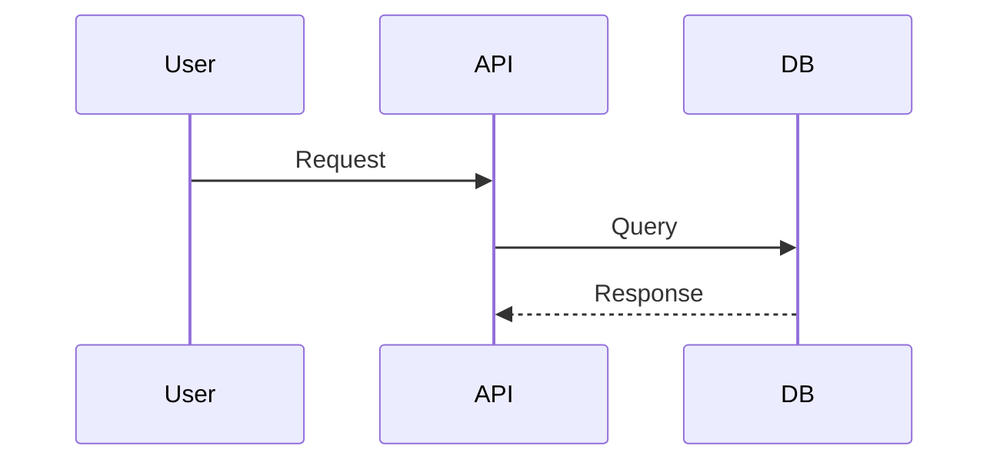

# Feature Specification: 
Status: Draft
Owner: 
Complexity Score: 

## 1. The Intent (Why?)
The goal of this feature is to...

## 2. User Stories (The "What")
*   Story 1: Given a logged-in user, When they click "Export", Then a CSV is downloaded.
*   Story 2: ...

## 3. Functional Requirements
*   [ ] Input validation for email fields.
*   [ ] Rate limiting (10 req/min).

## 4. The Anti-Requirements (Out of Scope)
*   *   No changes to the billing system.
*   No support for mobile layouts in this iteration.

## 5. Visual Flow / Architecture

## 6. Success Criteria

* [ ] Unit tests pass with >90% coverage.
* [ ] Latency is under 200ms.